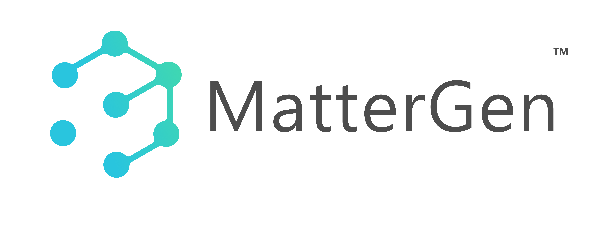
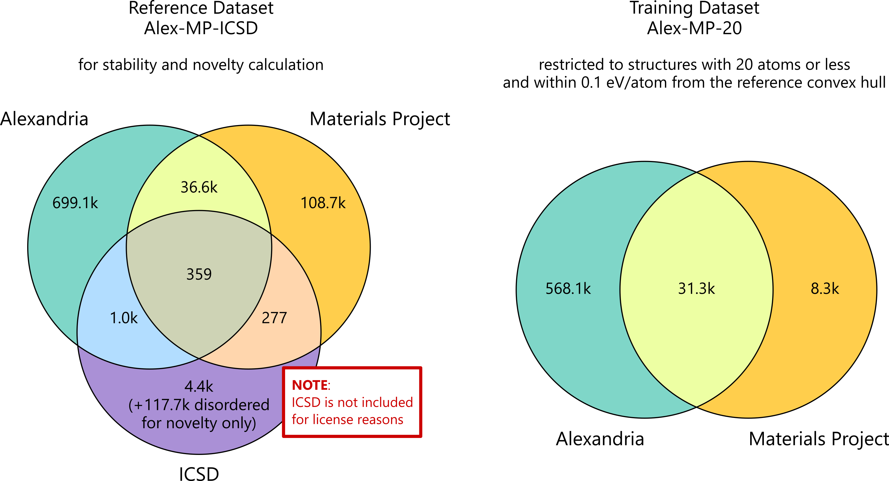

<h1>
<p align="center">
    
</p>
</h1>

<h4 align="center">

[](https://www.nature.com/articles/s41586-025-08628-5)
[](https://arxiv.org/abs/2312.03687)
[](https://python.org/downloads)
</h4>

MatterGen is a generative model for inorganic materials design across the periodic table that can be fine-tuned to steer the generation towards a wide range of property constraints.


## Table of Contents
- [Installation](#installation)
- [Get started with a pre-trained model](#get-started-with-a-pre-trained-model)
- [Generating materials](#generating-materials)
- [Evaluation](#evaluation)
- [Train MatterGen yourself](#train-mattergen-yourself)
- [Data release](#data-release)
- [Citation](#citation)
- [Trademarks](#trademarks)
- [Responsible AI Transparency Documentation](#responsible-ai-transparency-documentation)
- [Get in touch](#get-in-touch)

## Installation


The easiest way to install prerequisites is via [uv](https://docs.astral.sh/uv/), a fast Python package and project manager.

The MatterGen environment can be installed via the following command (assumes you are running Linux and have a CUDA GPU):
```bash
pip install uv
uv venv .venv --python 3.10 
source .venv/bin/activate
uv pip install -e .
```

Note that our datasets and model checkpoints are provided inside this repo via [Git Large File Storage (LFS)](https://git-lfs.com/). To find out whether LFS is installed on your machine, run
```bash
git lfs --version
```
If this prints some version like `git-lfs/3.0.2 (GitHub; linux amd64; go 1.18.1)`, you can skip the following step.

### Apple Silicon
> [!WARNING]
> Running MatterGen on Apple Silicon is **experimental**. Use at your own risk.  
> Further, you need to run `export PYTORCH_ENABLE_MPS_FALLBACK=1` before any training or generation run.

To install the environment for Apple Silicon, run these commands:
```bash
cp pyproject.toml pyproject.linux.toml
mv pyproject_apple_silicon.toml pyproject.toml
pip install uv
uv venv .venv --python 3.10 
source .venv/bin/activate
uv pip install -e .
export PYTORCH_ENABLE_MPS_FALLBACK=1  # required to run MatterGen on Apple Silicon
```


### Install Git LFS
If Git LFS was not installed before you cloned this repo, you can install it and download the missing files via:
```bash
sudo apt install git-lfs
git lfs install
git lfs pull  # this downloads the missing files
```

## Get started with a pre-trained model
We provide checkpoints of an unconditional base version of MatterGen as well as fine-tuned models for these properties:
* `mattergen_base`: unconditional base model
* `chemical_system`: fine-tuned model conditioned on chemical system
* `space_group`: fine-tuned model conditioned on space group
* `dft_mag_density`: fine-tuned model conditioned on magnetic density from DFT
* `dft_band_gap`: fine-tuned model conditioned on band gap from DFT
* `ml_bulk_modulus`: fine-tuned model conditioned on bulk modulus from ML predictor
* `dft_mag_density_hhi_score`: fine-tuned model jointly conditioned on magnetic density from DFT and HHI score
* `chemical_system_energy_above_hull`: fine-tuned model jointly conditioned on chemical system and energy above hull from DFT

The checkpoints are located at `checkpoints/<model_name>`. 

> [!NOTE]
> The checkpoints provided were re-trained using this repository, i.e., are not identical to the ones used in the paper. Hence, results may slightly deviate from those in the publication. 

## Generating materials
### Unconditional generation
To sample from the pre-trained base model, run the following command.
```bash
export MODEL_PATH=checkpoints/mattergen_base  # Or provide your own model
export RESULTS_PATH=results/  # Samples will be written to this directory

# generate batch_size * num_batches samples
python scripts/generate.py $RESULTS_PATH $MODEL_PATH --batch_size=16 --num_batches 1
```
This script will write the following files into `$RESULTS_PATH`:
* `generated_crystals_cif.zip`: a ZIP file containing a single `.cif` file per generated structure.
* `generated_crystals.extxyz`, a single file containing the individual generated structures as frames.
* If `--record-trajectories == True` (default): `generated_trajectories.zip`: a ZIP file containing a `.extxyz` file per generated structure, which contains the full denoising trajectory for each individual structure.
> [!TIP]
> For best efficiency, increase the batch size to the largest your GPU can sustain without running out of memory.
### Property-conditioned generation
With a fine-tuned model, you can generate materials conditioned on a target property.
For example, to sample from the model trained on magnetic density, you can run the following command.
```bash
export MODEL_NAME=dft_mag_density
export MODEL_PATH="checkpoints/$MODEL_NAME"  # Or provide your own model
export RESULTS_PATH="results/$MODEL_NAME/"  # Samples will be written to this directory, e.g., `results/dft_mag_density`

# Generate conditional samples with a target magnetic density of 0.15
python scripts/generate.py $RESULTS_PATH $MODEL_PATH --batch_size=16 --checkpoint_epoch=last --properties_to_condition_on="{'dft_mag_density': 0.15}" --diffusion_guidance_factor=2.0
```
> [!TIP]
> The argument `--diffusion-guidance-factor` corresponds to the $\gamma$ parameter in [classifier-free diffusion guidance](https://sander.ai/2022/05/26/guidance.html). Setting it to zero corresponds to unconditional generation, and increasing it further tends to produce samples which adhere more to the input property values, though at the expense of diversity and realism of samples.

### Multiple property-conditioned generation
You can also generate materials conditioned on more than one property. For instance, you can use the pre-trained model located at `checkpoints/chemical_system_energy_above_hull` to generate conditioned on chemical system and energy above the hull, or the model at `checkpoints/dft_mag_density_hhi_score` for joint conditioning on [HHI score](https://en.wikipedia.org/wiki/Herfindahl%E2%80%93Hirschman_index) and magnetic density.
Adapt the following command to your specific needs:
```bash
export MODEL_NAME=chemical_system_energy_above_hull
export MODEL_PATH="checkpoints/$MODEL_NAME"  # Or provide your own model
export RESULTS_PATH="results/$MODEL_NAME/"  # Samples will be written to this directory, e.g., `results/dft_mag_density`
python scripts/generate.py $RESULTS_PATH $MODEL_PATH --batch_size=16 --checkpoint_epoch=last --properties_to_condition_on="{'energy_above_hull': 0.05, 'chemical_system': 'Li-O'}" --diffusion_guidance_factor=2.0
```
## Evaluation

Once you have generated a list of structures contained in `$RESULTS_PATH` (either using MatterGen or another method), you can relax the structures using the default MatterSim machine learning force field (see [repository](https://github.com/microsoft/mattersim)) and compute novelty, uniqueness, stability (using energy estimated by MatterSim), and other metrics via the following command:
```bash
python scripts/evaluate.py --structures_path=$RESULTS_PATH --relax=True --structure_matcher='disordered' --save_as="$RESULTS_PATH/metrics.json"
```
This script will write `metrics.json` containing the metric results to `$RESULTS_PATH` and will print it to your console.
> [!IMPORTANT]
> The evaluation script in this repository uses [MatterSim](https://github.com/microsoft/mattersim), a machine-learning force field (MLFF) to relax structures and assess their stability via MatterSim's predicted energies. While this is orders of magnitude faster than evaluation via density functional theory (DFT), it doesn't require a license to run the evaluation, and typically has a high accuracy, there are important caveats. (1) In the MatterGen publication we use DFT to evaluate structures generated by all models and baselines; (2) DFT is more accurate and reliable, particularly in less common chemical systems. Thus, evaluation results obtained with this evaluation code may give different results than DFT evaluation; and we recommend to confirm results obtained with MLFFs with DFT before drawing conclusions. 

> [!TIP]
> By default, this uses `MatterSim-v1-1M`. If you would like to use the larger `MatterSim-v1-5M` model, you can add the `--potential_load_path="MatterSim-v1.0.0-5M.pth"` argument. You may also check the [MatterSim repository](https://github.com/microsoft/mattersim) for the latest version of the model. 


If, instead, you have relaxed the structures and obtained the relaxed total energies via another mean (e.g., DFT), you can evaluate the metrics via:
```bash
python scripts/evaluate.py --structures_path=$RESULTS_PATH --energies_path='energies.npy' --relax=False --structure_matcher='disordered' --save_as='metrics'
```
This script will try to read structures from disk in the following precedence order:
* If `$RESULTS_PATH` points to a `.xyz` or `.extxyz` file, it will read it directly and assume each frame is a different structure.
* If `$RESULTS_PATH` points to a `.zip` file containing `.cif` files, it will first extract and then read the cif files.
* If `$RESULTS_PATH` points to a directory, it will read all `.cif`,  `.xyz`, or `.extxyz` files in the order they occur in `os.listdir`.

Here, we expect `energies.npy` to be a numpy array with the entries being `float` energies in the same order as the structures read from `$RESULTS_PATH`.
## Train MatterGen yourself
Before we can train MatterGen from scratch, we have to unpack and preprocess the dataset files.

### Pre-process a dataset for training

You can run the following command for `mp_20`:
```bash
unzip data-release/mp-20/mp_20.zip -d datasets
python scripts/csv_to_dataset.py --csv-folder datasets/mp_20/ --dataset-name mp_20 --cache-folder datasets/cache
```
You will get preprocessed data files in `datasets/cache/mp_20`.

To preprocess our larger `alex_mp_20` dataset, run:
```bash
unzip data-release/alex-mp/alex_mp_20.zip -d datasets
python scripts/csv_to_dataset.py --csv-folder datasets/alex_mp_20/ --dataset-name alex_mp_20 --cache-folder datasets/cache
```
This will take some time (~1h). You will get preprocessed data files in `datasets/cache/alex_mp_20`.

### Training
You can train the MatterGen base model on `mp_20` using the following command.

```bash
python scripts/run.py data_module=mp_20 ~trainer.logger
```
> [!NOTE]
> For Apple Silicon training, add `~trainer.strategy trainer.accelerator=mps` to the above command.

The validation loss (`loss_val`) should reach 0.4 after 360 epochs (about 80k steps). The output checkpoints can be found at `outputs/singlerun/${now:%Y-%m-%d}/${now:%H-%M-%S}`. We call this folder `$MODEL_PATH` for future reference. 
> [!NOTE]
> We use [`hydra`](https://hydra.cc/docs/intro/) to configure our training and sampling jobs. The hierarchical configuration can be found under [`mattergen/conf`](mattergen/conf). In the following we make use of `hydra`'s config overrides to update these configs via the CLI. See the `hydra` [documentation](https://hydra.cc/docs/advanced/override_grammar/basic/) for an introduction to the config override syntax.

> [!TIP]
> By default, we disable Weights & Biases (W&B) logging via the `~trainer.logger` config override. You can enable it by removing this override. In [`mattergen/conf/trainer/default.yaml`](mattergen/conf/trainer/default.yaml), you may enter your W&B logging info or specify your own logger.

To train the MatterGen base model on `alex_mp_20`, use the following command:
```bash
python scripts/run.py data_module=alex_mp_20 ~trainer.logger trainer.accumulate_grad_batches=4
```
> [!NOTE]
> For Apple Silicon training, add `~trainer.strategy trainer.accelerator=mps` to the above command.

> [!TIP]
> Note that a single GPU's memory usually is not enough for the batch size of 512, hence we accumulate gradients over 4 batches. If you still run out of memory, increase this further.

#### Crystal structure prediction
Even though not a focus of our paper, you can also train MatterGen in crystal structure prediction (CSP) mode, where it does not denoise the atom types during generation. 
This gives you the ability to condition on a specific chemical formula for generation. You can train MatterGen in this mode by passing `--config-name=csp` to `run.py`.

To sample from this model, pass `--target_compositions=[{"<element1>": <number_of_element1_atoms>, "<element2>": <number_of_element2_atoms>, ..., "<elementN>": <number_of_elementN_atoms>}] --sampling-config-name=csp` to `generate.py`. 
An example composition could be `--target_compositions=[{"Na": 1, "Cl": 1}]`.
### Fine-tuning on property data

Assume that you have a MatterGen base model at `$MODEL_PATH` (e.g., `checkpoints/mattergen_base`). You can fine-tune MatterGen using the following command.

```bash
export PROPERTY=dft_mag_density
export MODEL_PATH=checkpoints/mattergen_base
python scripts/finetune.py adapter.model_path=$MODEL_PATH data_module=mp_20 +lightning_module/diffusion_module/model/property_embeddings@adapter.adapter.property_embeddings_adapt.$PROPERTY=$PROPERTY ~trainer.logger data_module.properties=["$PROPERTY"]
```
`dft_mag_density` denotes the target property for fine-tuning. 
> [!NOTE]
> For Apple Silicon training, add `~trainer.strategy trainer.accelerator=mps` to the above command.


> [!TIP]
> You can select any property that is available in the dataset. See [`mattergen/conf/data_module/mp_20.yaml`](mattergen/conf/data_module/mp_20.yaml) or [`mattergen/conf/data_module/alex_mp_20.yaml`](mattergen/conf/data_module/alex_mp_20.yaml) for the list of supported properties. You can also add your own custom property data. See [below](#fine-tune-on-your-own-property-data) for instructions.

#### Multi-property fine-tuning
You can also fine-tune MatterGen on multiple properties. For instance, to fine-tune it on `dft_mag_density` and `dft_band_gap`, you can use the following command.

```bash
export PROPERTY1=dft_mag_density
export PROPERTY2=dft_band_gap 
export MODEL_PATH=checkpoints/mattergen_base
python scripts/finetune.py adapter.model_path=$MODEL_PATH data_module=mp_20 +lightning_module/diffusion_module/model/property_embeddings@adapter.adapter.property_embeddings_adapt.$PROPERTY1=$PROPERTY1 +lightning_module/diffusion_module/model/property_embeddings@adapter.adapter.property_embeddings_adapt.$PROPERTY2=$PROPERTY2 ~trainer.logger data_module.properties=["$PROPERTY1","$PROPERTY2"]
```
> [!TIP]
> Add more properties analogously by adding these overrides:
> 1. `+lightning_module/diffusion_module/model/property_embeddings@adapter.adapter.property_embeddings_adapt.<my_property>=<my_property>`
> 2. Add `<my_property>` to the `data_module.properties=["$PROPERTY1","$PROPERTY2",...,<my_property>]` override.

> [!NOTE]
> For Apple Silicon training, add `~trainer.strategy trainer.accelerator=mps` to the above command.

#### Fine-tune on your own property data
You may also fine-tune MatterGen on your own property data. Essentially what you need is a property value (typically `float`) for a subset of the data you want to train on (e.g., `alex_mp_20`). Proceed as follows:
1. Add the name of your property to the `PROPERTY_SOURCE_IDS` list inside [`mattergen/mattergen/common/utils/globals.py`](mattergen/mattergen/common/utils/globals.py).
2. Add a new column with this name to the dataset(s) you want to train on, e.g., `datasets/alex_mp_20/train.csv` and `datasets/alex_mp_20/val.csv` (requires you to have followed the [pre-processing steps](#pre-process-a-dataset-for-training)).
3. Re-run the CSV to dataset script `python scripts/csv_to_dataset.py --csv-folder datasets/<MY_DATASET>/ --dataset-name <MY_DATASET> --cache-folder datasets/cache`, substituting your dataset name for `MY_DATASET`.
4. Add a `<your_property>.yaml` config file to [`mattergen/conf/lightning_module/diffusion_module/model/property_embeddings`](mattergen/conf/lightning_module/diffusion_module/model/property_embeddings). If you are adding a float-valued property, you may copy an existing configuration, e.g., [`dft_mag_density.yaml`](mattergen/conf/lightning_module/diffusion_module/model/property_embeddings/dft_mag_density.yaml). More complicated properties will require you to create your own custom `PropertyEmbedding` subclass, e.g., see the [`space_group`](mattergen/conf/lightning_module/diffusion_module/model/property_embeddings/space_group.yaml) or [`chemical_system`](mattergen/conf/lightning_module/diffusion_module/model/property_embeddings/chemical_system.yaml) configs.
5. Follow the [instructions for fine-tuning](#fine-tuning-on-property-data) and reference your own property in the same way as we used the existing properties like `dft_mag_density`.

## Data release
We provide datasets to train as well as evaluate MatterGen. For more details and license information see the respective README files under [`data-release`](data-release).
### Training datasets
* MP-20 ([Jain et al., 2013](https://pubs.aip.org/aip/apm/article/1/1/011002/119685)): contains 45k general inorganic materials, including most experimentally known materials with no more than 20 atoms in unit cell.
* Alex-MP-20: Training dataset consisting of around 600k structures from MP-20 and Alexandria ([Schmidt et al. 2022](https://archive.materialscloud.org/record/2022.126)) with at most 20 atoms inside the unit cell and below 0.1 eV/atom of the convex hull. See the venn diagram below and the MatterGen paper for more details.

### Reference dataset
We further provide the Alex-MP reference dataset which can be used to evaluate novelty and stability of generated samples. 
The reference set contains 845,997 structures with their DFT energies. See the following Venn diagram for more details about the composition of the training and reference datasets.
> [!NOTE]
> For license reasons, we cannot share the 4.4k ordered + 117.7k disordered ICSD structures, so results may differ from those in the paper. 



### CIFs and experimental measurements
The [`data-release`](data-release) directory also contains the CIF files to all structures shown in the paper as well as xps, xrd, and nanoindentation measurements of the TaCr2O6 sample presented in the paper.

## Citation
If you are using our code, model, data, or evaluation pipeline, please consider citing our work:
```bibtex
@article{MatterGen2025,
  author  = {Zeni, Claudio and Pinsler, Robert and Z{\"u}gner, Daniel and Fowler, Andrew and Horton, Matthew and Fu, Xiang and Wang, Zilong and Shysheya, Aliaksandra and Crabb{\'e}, Jonathan and Ueda, Shoko and Sordillo, Roberto and Sun, Lixin and Smith, Jake and Nguyen, Bichlien and Schulz, Hannes and Lewis, Sarah and Huang, Chin-Wei and Lu, Ziheng and Zhou, Yichi and Yang, Han and Hao, Hongxia and Li, Jielan and Yang, Chunlei and Li, Wenjie and Tomioka, Ryota and Xie, Tian},
  journal = {Nature},
  title   = {A generative model for inorganic materials design},
  year    = {2025},
  doi     = {10.1038/s41586-025-08628-5},
}
```

## Trademarks

This project may contain trademarks or logos for projects, products, or services.
Authorized use of Microsoft trademarks or logos is subject to and must follow [Microsoft's Trademark & Brand Guidelines](https://www.microsoft.com/en-us/legal/intellectualproperty/trademarks/usage/general).
Use of Microsoft trademarks or logos in modified versions of this project must not cause confusion or imply Microsoft sponsorship.
Any use of third-party trademarks or logos are subject to those third-party's policies.

## Responsible AI Transparency Documentation

The responsible AI transparency documentation can be found [here](MODEL_CARD.md).


## Get in touch

If you have any questions not covered here, please create an issue or contact the
Materials Design team at [ai4s-materials@microsoft.com](mailto:ai4s-materials@microsoft.com).

We would appreciate your feedback and would like to know how MatterGen has been beneficial to your research.
Please share your experiences with us at [ai4s-materials@microsoft.com](mailto:ai4s-materials@microsoft.com).